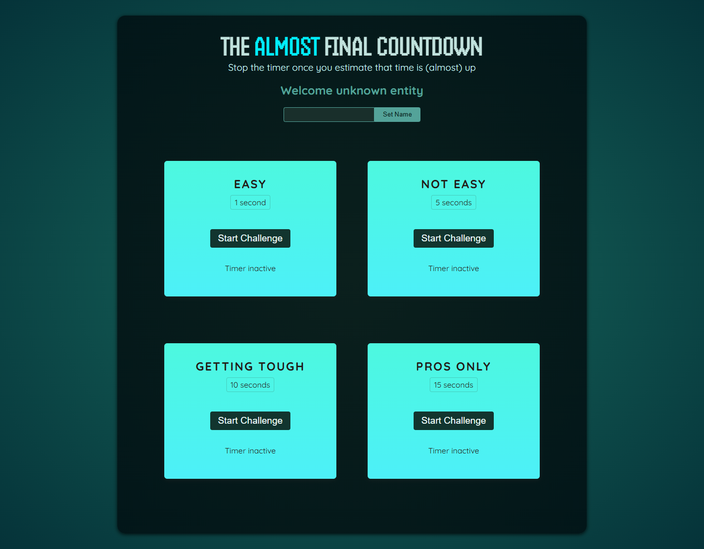

# The Almost Final Countdown

A playful React timer challenge game where players try to stop each timer as close to the target time as possible. The project focuses on refs, portals, timers, and clean component-driven UI.



## Features

- **Multiple Timer Challenges**: Play across easy, medium, tough, and pro-level countdown targets.
- **Precision Scoring**: Stop the timer close to the target time to earn a better result.
- **Player Name Entry**: Personalize the experience before starting a challenge.
- **Result Modal**: Review challenge outcomes in a modal rendered through a React portal.
- **Reusable Components**: Built with focused React components for player input, challenges, and results.

## Installation

To get started with The Almost Final Countdown, follow these steps:

1. Clone the repository:
    ```bash
    git clone https://github.com/hristianivanov/DemoGame-Countdown-ReactApp.git
    ```
2. Navigate to the project directory and install the dependencies:
    ```bash
    npm install
    ```
3. Start the development server:
    ```bash
    npm run dev
    ```

The app should now be running locally, accessible through your browser at `http://localhost:5173` by default.

## License

No license file is currently included in this repository.
